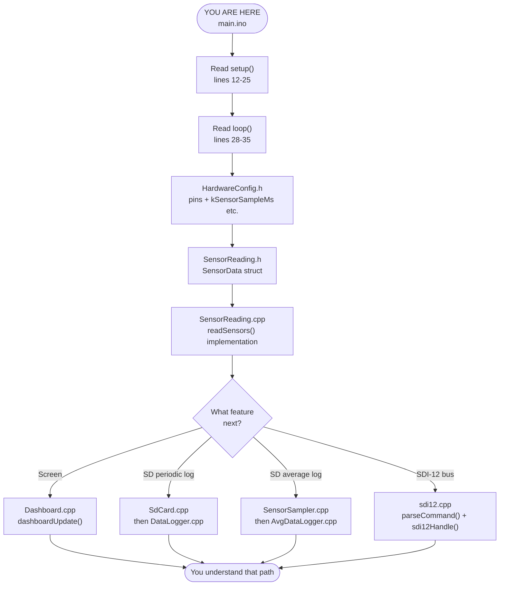
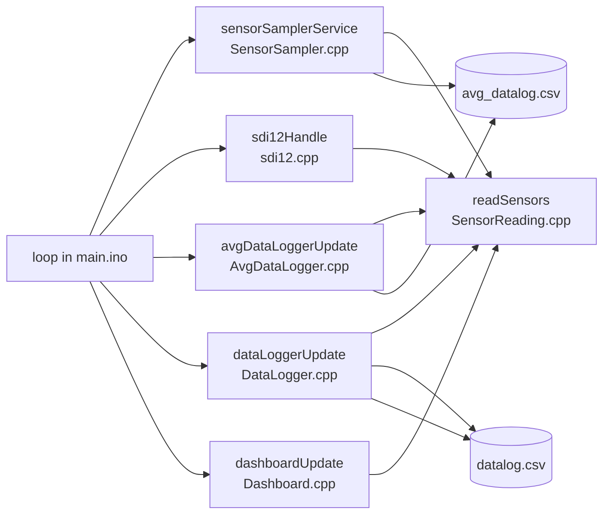

# Code reading flowchart

**Start here:** `main/main.ino`

Open this file in GitHub, VS Code, or any Mermaid preview to see the interactive chart.

---

## Main reading path

---

## How `loop()` connects files (runtime flow)

Read this **after** step 3 (`SensorReading`).

---

## Quick reference

| Order | File | Look for |
|-------|------|----------|
| 1 | `main.ino` | `setup()`, `loop()` |
| 2 | `HardwareConfig.h` | `kSensorSampleMs`, pins |
| 3 | `SensorReading.cpp` | `readSensors()`, `getSensorData()` |
| 4 | *(pick one)* | See branches above |

**Do not start with** `SensorSampler.cpp` or `AvgDataLogger.cpp` — they only make sense after `main.ino` and `SensorReading.cpp`.

---

See also: `SYSTEM_WORKFLOW.md` and `SYSTEM_WORKFLOW.pdf`
