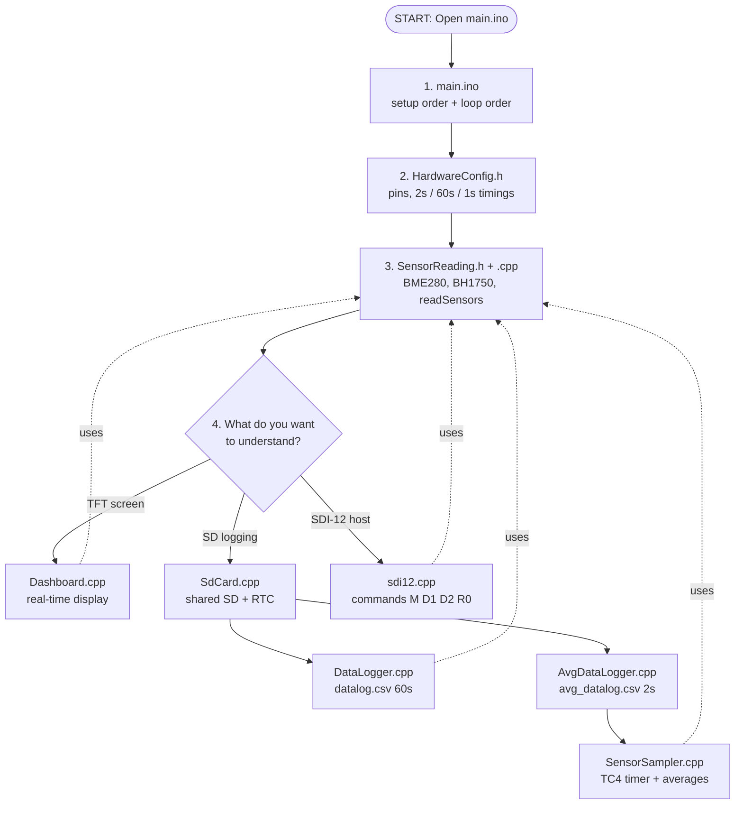
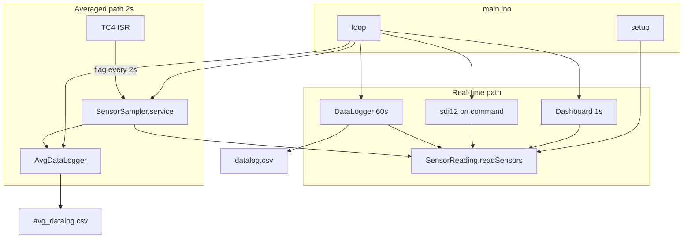

# SDI-12 Sensor Station — System Workflow

**Board:** Arduino Zero / MKR / SAMD21 (TC4 hardware timer)  
**Project folder:** `Testing Environment/main/`

**PDF version:** `docs/SYSTEM_WORKFLOW.pdf` (includes this reading-order chart)

---

## 0. Where to start reading (flowchart)

Use this order the first time you open the project. Follow the arrows top → bottom, then pick a branch for the feature you care about.



### Reading order (numbered list)

| Step | File | Why read it |
|------|------|-------------|
| **1** | `main.ino` | Only entry point — shows what runs and in what order |
| **2** | `HardwareConfig.h` | All pin defines and millisecond constants in one place |
| **3** | `SensorReading.h` → `SensorReading.cpp` | Core I2C sensors; every other module calls this |
| **4a** | `Dashboard.cpp` | If you care about the TFT (real-time, not averages) |
| **4b** | `SdCard.cpp` → `DataLogger.cpp` | If you care about `datalog.csv` and buttons |
| **4c** | `SensorSampler.cpp` → `AvgDataLogger.cpp` | If you care about 2 s timer averages + `avg_datalog.csv` |
| **4d** | `sdi12.cpp` | If you care about the SDI-12 slave protocol |

### One-page ASCII chart (print-friendly)

```
                    +------------------+
                    |  START: main.ino |
                    +--------+---------+
                             |
              +--------------+--------------+
              v              v              v
     HardwareConfig.h   SensorReading.*    (see loop below)
              |
              +----------+----------+----------+----------+
              |          |          |          |          |
              v          v          v          v          v
         Dashboard   SdCard.cpp  SensorSampler  sdi12.cpp
         (TFT 1s)       |         (TC4 2s)     (Serial1)
                         |
                    +----+----+
                    v         v
              DataLogger  AvgDataLogger
              datalog.csv avg_datalog.csv
```

**Rule of thumb:** Always read **`main.ino` → `HardwareConfig.h` → `SensorReading`** first. Only then open the branch for the feature you need.

---

## 1. Big picture: two sensor paths

Do not mix these up — they use the same physical sensors but different timing and files.

| Path | Used by | How data is obtained | Output |
|------|---------|----------------------|--------|
| **Real-time** | Dashboard, SDI-12, `DataLogger` | `readSensors()` when needed | TFT, Serial1, `datalog.csv` |
| **Averaged (2 s)** | `AvgDataLogger` only | TC4 timer → `sensorSamplerService()` | `avg_datalog.csv` |



---

## 2. File map

| File | Responsibility |
|------|----------------|
| `main.ino` | Startup order and loop order |
| `HardwareConfig.h` | Pin defines and all timing constants |
| `SensorReading.cpp` | BME280 + BH1750 drivers, `sensorBuffer` |
| `SensorSampler.cpp` | TC4 ISR, 2 s averaging, **not** used by dashboard |
| `SdCard.cpp` | Single SD + RTC for both loggers |
| `DataLogger.cpp` | `datalog.csv`, buttons pin 2 / 3 |
| `AvgDataLogger.cpp` | `avg_datalog.csv` only |
| `Dashboard.cpp` | TFT, real-time `readSensors()` |
| `sdi12.cpp` | SDI-12 slave protocol |

---

## 3. `setup()` sequence

```
Serial.begin(9600)
sensorsInit()           // I2C sensors
sdCardInit()            // SD + RTC (shared)
sensorSamplerInit()     // TC4 timer ON
dataLoggerInit()        // datalog.csv header, buttons
avgDataLoggerInit()     // avg_datalog.csv header
dashboardInit()         // TFT static labels
sdi12Init('0', 8)       // SDI-12
readSensors()           // initial values
```

---

## 4. `loop()` sequence (order matters)

```
1. sensorSamplerService()   ← process 2 s hardware ticks FIRST
2. sdi12Handle()            ← host commands + R0 stream
3. avgDataLoggerUpdate()    ← write avg_datalog.csv if new average
4. dataLoggerUpdate()       ← 60 s + manual log, clear button
5. dashboardUpdate()        ← TFT every 1 s, real-time read
```

---

## 5. Averaged path (2 seconds)

1. **TC4 ISR** runs every ~10 ms (hardware).
2. ISR divides by 200 → one `g_sampleTicksPending++` every **2 s**.
3. **`sensorSamplerService()`** (in loop, not ISR):
   - Decrements pending ticks
   - Calls `readSensors()` per tick
   - After 1 sample → `finalizeAverageWindow()`
4. **`avgDataLoggerUpdate()`** writes one CSV row, clears ready flag.

**Important:** I2C is **never** called inside the ISR.

---

## 6. Real-time path

| Consumer | When | Action |
|----------|------|--------|
| Dashboard | Every 1000 ms | `readSensors()` → `getSensorData()` → TFT |
| DataLogger | Every 60000 ms or button 2 | `readSensors()` → `datalog.csv` |
| SDI-12 | On `M`, `D1`, `D2`, `R0`, stream | `readSensors()` → `getSensorData()` |
| Button 3 | On press | Delete **`datalog.csv` only** |

---

## 7. CSV files

| File | Rate | Content |
|------|------|---------|
| `datalog.csv` | 60 s + manual | Snapshot at log time |
| `avg_datalog.csv` | ~2 s | Timer-averaged row (`ISR_Avg`) |

---

## 8. Timing reference (`HardwareConfig.h`)

| Constant | Value |
|----------|-------|
| `kSensorSampleMs` | 2000 ms |
| `kSensorAverageMs` | 2000 ms |
| `kTc4BasePeriodMs` | 10 ms (ISR base, divided to 2 s) |
| `kDashboardRefreshMs` | 1000 ms |
| `kLogIntervalMs` | 60000 ms |

---

## 9. Generate PDF

From the `docs` folder:

```bash
python generate_workflow_pdf.py
```

Output: `docs/SYSTEM_WORKFLOW.pdf`
